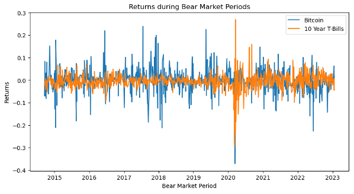

 <dir align="center">  Hedging in a Bear Market 

<dir align="left">

### Project 1 Group 2 Contributors:
* Aakshay Gautam
* Emmanuel Joseph
* Jennifer Kerr
* Rei Dema
* Tarun Midha

## **Executive Summary**

Over the last two years, our lives changed in ways we've never seen before and hopefully will never see again.  Between stay-at-home orders, record housing prices, market highs and lows our lives will never be the same.  We have also seen technology rapidly advancing and the fintech industry expanding.  As we come out of this period, we are seeing high rates of inflation and signs are showing that we may be heading into a recession.  With this in mind, investors are looking for ways to hedge in a Bull Market and potentially a Recession.
  
## **Concept**
We wanted to compare the relationships among different asset classes over a period of time to see if any of them seem to hedge the market during downturns.  The classes that we decided to evaluate are:
* 10-Year Treasury Bonds from different counties
* BITCOIN
* Gold 
* Crude Oil 
* US House Pricing Index

For the 10-Year Treasury Bonds, we wanted to look at various countries who had various economic and political differences to see how they trended.  Based on available data and research, we chose to use the following countires:
* USA
* UK
* China
* India
* Japan
* EU
* Brazil
* South Africa
* Egypt
* Nigeria
* Australia
* Germany
* Canada
* France
* Russia

We decided to use various graphs to plot the daily changes in the price of 10Y T-Bills, daily changes in the price of Bitcoin, daily changes in the prices of gold, daily changes in the prices of crude oil and the changes in US House Pricing Index.

## **Data Collection and Clean-Up**
We used various data sources including Fred, investing.com, alpalca and yfinance.  While gathering the data, we realized that some data was available daily whereas other was only available monthly.  Because of this, we had to clean the data to ensure that we were consistent and able to compare the data.  

We also used various Python packages to help us get, clean and analyse the data.  These packages include:
* pandas
* Path
* fredapi
* alpaca_trade
* alfa_vantage
* yfinance 
* fredapi

By combining these various packages and using them together, we were able to import all our required data, clean the data, analyse the data and create graphs and charts to help tell our story.

## **Approach**

## **Analysis**
With all the data available, we looked to answer a few key quesitons using python analysis and graphs.

### Question 1:
How does Bitcoin perform as a hedge during bear markets when compared to the US 10 year T-Bills?  
We analysed the data for the monthly price changes for BTC and the 10 year T-Bills for all the major world economies selected.
After taking this month over month data and compiling it, we ploted the data on a graph to study the trends and relationship between the two, focusing on the times a bear market is in session.

We can see in the graph above that BTC returns vs 10 yr US t-bill 
returns moved in different directions (bitcoin having much higher volatility) up until 2020. Around 2020 is when bitcoin gained footing as a major part of the economy.  This came about due to BTC's massive increase in price, popularity and consumer confidence.From this, we can see that up until 2020 BTC and US T-bills were a good combo to hedge against one another.
However, as BTC gained popularity and because a large player in the market, we see that it is now moving with the market. We see that as the US T-bill rate swung massively in 2020 and devalued bonds by large amounts the BTC returns immediately dropped. The reason being is that large corporations and big players started to purchase BTC and those big players were also affected by t-bill rates as they are most likely owners of debt in the form of bonds. As the interest on the bonds increases had you been in possession of BTC you would need to liquidate your BTC in order to support your bond loan debt. As a result the two began to move together and we see a decrease in the price of BTC as sell offs occur in order to keep up with the increasing debt expense. So in conclusion, hedging strategies ideally will help to provide more liquidity during a bear market. 

## **Demo**

## **Further Steps**

  
  
## **Links**
### Data Links
Bitcoin: https://fred.stlouisfed.org/series/CBBTCUSD  
US House Price Index: https://fred.stlouisfed.org/series/USSTHPI   
Various 10-Year T-Bond Returns: https://fred.stlouisfed.org  
Various 10-Year T-Bond Returns: https://ca.investing.com/

### Other Links Referenced

